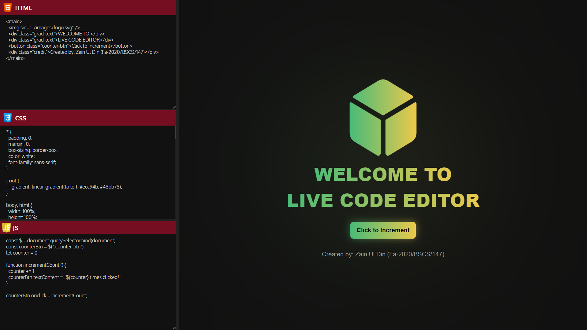

## Live Web Code Editor

A live web code editor inspired by code-pen for my university assignment.

Web Technologies used:

- HTML
- CSS
- Vanilla Javascript (No JQuery)

### Screenshots

Happy Coding 🙂
